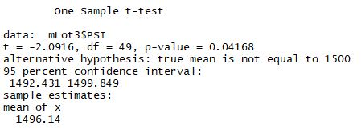

# MechaCar Challenge 

## Linear Regression to Predict MPG

### *Which variables/coefficients provided a non-random amount of variance to the mpg values in the dataset?*

The following variables provided a non-random amount of variance to the mpg values in the dataset
- Vehicle Length
- Ground Clearance

### *Is the slope of the linear model considered to be zero? Why or why not?*

The slope of the linear model is not considered to be zero because the p-value of the 5.35e-11 is less than the standard 0.05 95% confidence interval. This is means we are highly confident that the relationship between MPG and the listed variables above is not due to random chance.

### *Does this linear model predict mpg of MechaCar prototypes effectively? Why or why not?*

The linear model does an adequate job at predicting MPG of MechaCar prototypes. The model returns an r-squared value of 0.7149, meaning about 71% of the model can be explained by our variables. However, it would be good to look at other studies in the industry to see whether or an r-squared value of 0.7149 meets industries averages. 

## Summary Statistics on Suspension Coils

### *The design specifications for the MechaCar suspension coils dictate that the variance of the suspension coils must not exceed 100 pounds per square inch. Does the current manufacturing data meet this design specification for all manufacturing lots in total and each lot individually? Why or why not?*

Below is a summary table looking at the entire dataset that looks at mean, median, variance, and standard deviation

 

|   |Mean|Median|Variance|Standard Deviation|
|---|---|---|---|---|
| Total Summary  |  1498.78 |1500   |62.29   |7.89   |

 

From a holistic view, yes MechaCar passes the their variance threshold of 100 poudsn per square inch. 

However, when broken down by each manufacturing lot, Lot 3 seems to be an outlier causing a skew in the data. Please refer to the table below 

 

|   Lot|Mean|Median|Variance|Standard Deviation|
|---|---|---|---|---|
| 1  |  1500.00 |1500.00   |0.98   |7.89   |
| 2  |  1500.20 |1500.00  |7.47   |7.89   |
| 3  |  1496.14 |1498.50   |170.29   |7.89   |

 

Clearly there are quality issues at Lot 3 

## T-tests on Suspension Coils

### All Lot T-Test

When using the entire data set, the t-test shows that MechaCar's suspension coils are not statistically different from the population mean. Using a 95% confidence interval, a p-value of 0.06028 does not allow us to reject the null hypothesis
 

### Lot 1 t-test

When using the entire data set, the t-test shows that MechaCar's suspension coils are not statistically different from the population mean. Using a 95% confidence interval, a p-value of 1 does not allow us to reject the null hypothesis
 

### Lot 2 t-test

When using the entire data set, the t-test shows that MechaCar's suspension coils are not statistically different from the population mean. Using a 95% confidence interval, a p-value of 0.6072 does not allow us to reject the null hypothesis
 

### Lot 3 t-test

When using the entire data set, the t-test shows that MechaCar's suspension coils are statistically different from the population mean. Using a 95% confidence interval, a p-value of 0.04168 does allow us to reject the null hypothesis. Meaning we will need to look deeper in the the manufacturing process as we are 95% confident that the variance is real. 
 

# Study Design: MechaCar vs. Competition

In order to quantify the quality of MechaCar over the competition, MechaCar's safety rating is an important saftey rating for consumers.

The null hypothesis is that MechaCar does not have a higher saftey rating compared to the competition and the wish is that data is able to show that we can reject the null hypothesis. 

Assuming MechaCar has a higher average saftey rating compared to the industry average, we would run t-test to show confidence that MechaCar's higher rating is due to MechaCar's quality rather than chance. 

We would need to collect saftey rating data from various manufacturers in order to run this test. 

